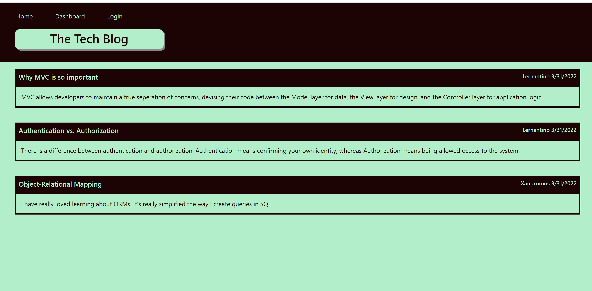

# Tech-Blog-Week-14

## Description

The goal of this project is to set up a tech blog server where users can post information they would like to share. Users when on the website are able to login, create, edit, delete, and comment on posts.

## Table of Contents

* [Installation
  ](#installation)  

* [Usage
  ](#usage)

* [License
  ](#license)

* [Contributing
  ](#contributing)

* [Example
  ](#example)

* [Questions
  ](#questions)

## Installation

To install necessary dependencies, run the following command:

'''
npm i 
'''

## Usage

Inorder for the user to be able to use the website they will need to click login, then sign up instead, and create an account. After they have an account they are able to login. On the home page they are able to click on posts which will pull up the comments and give them the ability to comment themselves. When they go to their dashboard they are able to see their own posts. When they are on the dashboard and click on their own post they are able to edit or delete it. When the user is done using the webiste they are able to logout by clicking logout in the navbar.

## License

This project is licensed under the MIT license.

## Contributing

The best way to contact me is through email.

## Example

In this example you can see that when the page is first loaded the user is presented with the home page.

## Questions

If you have any questions about the repo, open an issue or contact me directly at Nilesquackmeister@gmail.com. You can find more of my work at [NilesHachmeister](https: //github.com/NilesHachmeister/).